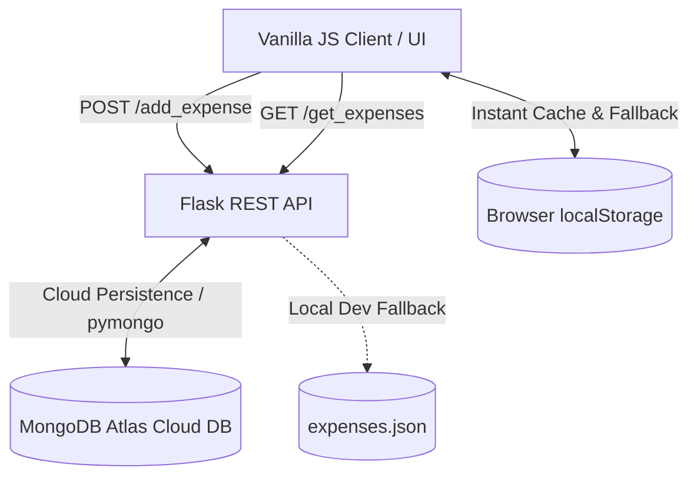

# Expense Tracker

A full-stack personal finance and expense tracking web application built with Python (Flask), Vanilla JavaScript, and MongoDB Atlas.

🔗 **Live Demo:** [expensetracker](https://expensetracker-athish.vercel.app)

## Features

- **Real-Time Expense Tracking**: Log expenses instantly with item name, amount, and date.
- **Dynamic Ledger & History**: Automatically calculates total expenditures and renders a responsive transaction table.
- **Dual Persistence Architecture**: Powered by MongoDB Atlas cloud database on the backend with client-side `localStorage` caching for zero latency and instant page loads.
- **Serverless Ready**: Fully configured for continuous deployment on Vercel with zero-configuration local fallbacks.

## Architecture

The application uses a decoupled client-server architecture with dual-layer persistence:

- **Frontend (Vanilla HTML5 / CSS3 / JavaScript)**: Handles user input, dynamic table manipulation, running total calculation, and local cache synchronization.
- **Backend (Flask REST API)**: Manages API routes (`/add_expense`, `/get_expenses`, `/api/status`), handles JSON serialization, and interacts with MongoDB Atlas via `pymongo`.



## Tech Stack

- **Frontend**: HTML5, CSS3, Vanilla JavaScript (ES6+), Fetch API, LocalStorage API
- **Backend**: Python 3.10+, Flask, PyMongo, DNS-Python
- **Database**: MongoDB Atlas (Cloud NoSQL), Local JSON Fallback
- **Deployment**: Vercel Serverless Functions (`@vercel/python`)

---

## Environment Variables

| Variable Name | Required | Description |
| :--- | :---: | :--- |
| `MONGODB_URI` | Optional (Prod) | MongoDB connection string (e.g. `mongodb+srv://<user>:<password>@cluster0.xxx.mongodb.net/expense_tracker?retryWrites=true&w=majority`). If omitted, app falls back to local storage. |

---

## Getting Started

### Prerequisites
- Python 3.10+
- `pip` (Python package manager)

### Local Setup

1. **Clone the repository:**
   ```bash
   git clone https://github.com/athishio/Expense-Tracker.git
   cd Expense-Tracker
   ```

2. **Install dependencies:**
   ```bash
   pip install -r requirements.txt
   ```

3. **(Optional) Configure Environment Variables:**
   Set `MONGODB_URI` in your terminal or create a `.env` file:
   ```bash
   export MONGODB_URI="your_mongodb_connection_string"
   ```

4. **Run the application:**
   ```bash
   python server.py
   ```

5. Open your browser and navigate to `http://localhost:5000`.

---

## Deployment (Vercel)

1. Import your GitHub repository to [Vercel](https://vercel.com).
2. Add your `MONGODB_URI` under **Project Settings > Environment Variables**.
3. In MongoDB Atlas **Network Access**, ensure IP `0.0.0.0/0` is allowed.
4. Deploy! Vercel will automatically build and serve the application using the configuration in `vercel.json`.
